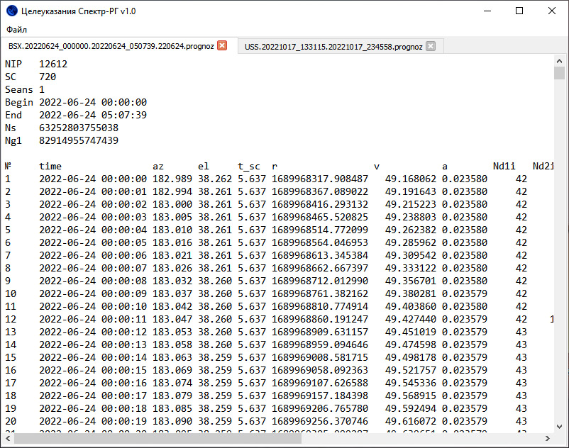

# Целеуказания Спектр-РГ

Распаковка бинарных файлов целеуказаний



## Релизы
### v1.0
* Загрузить [srg-cu-reader для Windows 10](http://10.42.100.204:8080/maksim/srg-cu-reader/release/v1.0/srg-cu-reader-w10.zip)
* Загрузить [srg-cu-reader для Windows 7](http://10.42.100.204:8080/maksim/srg-cu-reader/release/v1.0/srg-cu-reader-w7.zip)

## Запуск в интерпретаторе
```
python app.py
```

## Прочее

### Зависимости
* PyQt5
* pyinstaller (для создания exe-файла)


### Создание icon.ico с помощью ImageMagic
```
magic convert -background transparent "img/icon.png" -define icon:auto-resize=256,128,64,32,16 icon.ico
```

### Создание файла ресурсов
```
pyrcc5 resources.qrc -o resources.py
```